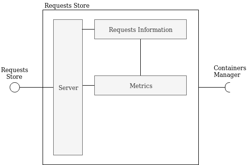
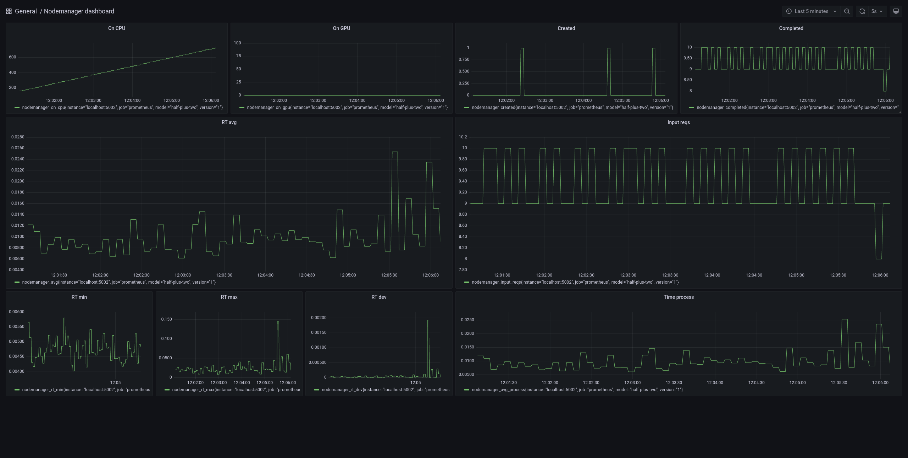

# Requests Store

This component takes care of requests. It is responsible for storing the information about the requests.



This component:

- saves information about requests (with Postgres database)
- produces metrics

## Required interfaces
The controller requires:

- *Containers Manager*: to get information about models


### Example of requests
[More information here](../common/README.md)


## Run
### Init
```
virtualenv env
source env/bin/activate
pip install -r requirements.txt
```
### Start
Start the Postgres DB container
```
docker run --name romadb -e POSTGRES_PASSWORD=romapwd -d -p 5432:5432 postgres
```
Then start the component
```
gunicorn -w <num_workers> "main:create_app(db_echo=False, delete_config=True)" --bind 0.0.0.0:5002
```

## Endpoints
See "rest-client.rest" for examples 

DEFAULT PORT: 5001

##### GET /
Get the status of the component

##### GET /requests
Get the requests

##### GET /metrics/model
Get the metrics grouped by model

##### GET /metrics/container
Get the metrics grouped by container

##### POST /requests
Post a request

##### DELETE /request
Delete the requests


### Prometheus
The requests store exposes a "/metrics" endpoint that ca be used with Prometheus.

The metrics are organized by model with the "model" and "version" labels,
and computed from the last time the request to the metrics endpoint was received.
E.g., if Promethues is configured with a scraping time of 5s, the metrics will be computed over the last 5s.

The exported metrics start with "nodemanager" and are:
- "completed": the number of completed requests
- "created": the number of created (queued) requests
- "input_reqs": input rate
- "on_gpu": number of requests completed by the GPU
- "on_cpu": number of requests completed by the CPU
- "avg": mean response time
- "avg_process": mean processing time
- "rt_dev": standard deviation response time
- "rt_min": minimum response time
- "rt_max": maximum response time

A simple grafana dashboard is available:

